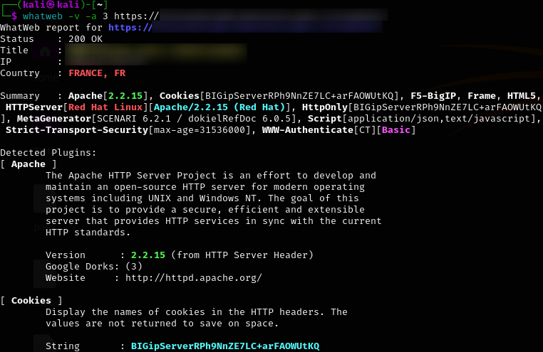
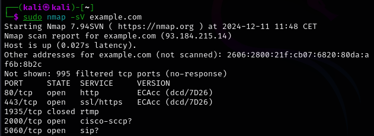

# Fil conducteur d'un audit d'application web
## Phase 1 - Prise d'informations

Cette phase est cruciale pour découvrir l'application et récupérer des informations nécessaires pour la phase d'exploitation. **Notez toutes les informations** trouvées, elles seront utiles par la suite.

### 1.1 Collecte des métadonnées

Rechercher les fichiers suivants :

- `robots.txt` : Indique les répertoires et pages du site ainsi que leur état d'indexation. En cas de blocage pour un "user agent", utilisez une extension pour changer l'agent et accéder à la page.
- `sitemap.xml` : Fournit une vue d'ensemble de **toutes les pages du site** à tester.
- `crossdomain.xml` : Informations sur la politique d'accès du domaine.

### 1.2 Tests de mise en erreur

Les réponses d'erreur peuvent révéler des informations sur le fonctionnement interne du site. Essayez d'accéder à des pages inexistantes (`/fake_page.html`) et modifiez les cookies en ajoutant `[]`, `]]` ou `[[` pour provoquer des erreurs révélatrices.

### 1.3 Analyse du code source

Inspectez le code source des pages (touche F12 ou clic-droit > Inspecter) pour :

- Trouver des **commentaires** contenant des données sensibles.
- Identifier des **champs de formulaire cachés** (`<input type="hidden">`).
- Analyser les **balises script** pour comprendre le traitement des données et détecter des failles potentielles comme le [Cross-Site Scripting (XSS)](#23-injection-xss).
- Examiner les fichiers **JavaScript** pour identifier les points d'entrée et les actions sur les données.

### 1.4 Analyse des technos utilisées

Utilisez des scanners de technologies pour déterminer les technologies de l'application :

- [Wappalyser](https://www.wappalyzer.com/) : extension de navigateur qui détecte les technologies sur l'application. Elle est facile à utiliser et fournit rapidement un aperçu des frameworks, bibliothèques et outils utilisés.
- [Whatweb](https://www.kali.org/tools/whatweb/) : utilitaire CLI pour une analyse plus approfondie :
```bash
whatweb -v -a 3 <URL>
```
On obtiendra une réponse de ce type :


Il y a donc toutes les technos trouvées avec des informations précises sur leur version, ce à quoi elles servent, etc. On pourra ensuite se baser sur les technos détectées pour la phase [Phase 2](#phase-2-recherche-et-exploitation-de-vulnerabilites).
Si certaines technos ne sont pas à jour : 
```
Le service web du serveur <FQDN> utilise une version trop ancienne et vulnérable de <techno>. Il conviendrait de mettre à jour et passer à la version la plus récente.
```

### 1.5 Scan des ports ouverts

Il peut être intéressant de scanner les ports ouverts du serveur. Pour cela, utilisez [Nmap](https://nmap.org/man/fr/) pour scanner l'hôte avec la commande :

``` bash
sudo nmap -sV <URL>
```

On aura un résultat de ce type (la réponse peut prendre quelques minutes à arriver, utiliser le flag `-v` permet de mettre `nmap` en mode *verbose* et donc de voir son avancée) :



On connait donc les **ports accessibles**, leur **état**, les **services** qu'ils fournissent ainsi que la **version** de ces services. Cette dernière information peut être très utile si l'on trouve un service avec ancienne version, vulnérable. Dans ce cas, il serait intéressant de signaler à l'exploitant cette vulnérabilité :

```
Le port <port> du serveur <FQDN> fournit un service <nom_du_service> sous la version <n°_de_version>. Cette version est trop ancienne et vulnérable, veuillez mettre à jour ce service vers une la version la plus récente et supportée de votre branche.
```

### 1.6 Scan de vulnérabilités

Utilisez [Wapiti](https://wapiti-scanner.github.io/) pour détecter les vulnérabilités potentielles :
```bash
wapiti -u <URL>:<port>
```
Wapiti génère un rapport HTML avec des informations sur les vulnérabilités et les correctifs possibles.

### 1.7 Liste des dossiers et fichiers

Utilisez [Dirb](https://www.kali.org/tools/dirb/) pour trouver les dossiers et fichiers accessibles :

```bash
dirb <URL> -o <fichier_output>
```

Pour plus de rapidité, utilisez `dirbuster` ou `gobuster`.
Couplez avec [Wfuzz](https://www.kali.org/tools/wfuzz/) pour maximiser les résultats :

```bash
wfuzz -c -z file,/usr/share/wfuzz/wordlist/general/common.txt --hc 404 <URL>/FUZZ
```

Ici, c'est une attaque par dictionnaire. On peut tester d'autres listes de mots pour espérer avoir plus de résultats.

À ce stade, vous devriez avoir une bonne connaissance de l'application et de ses vulnérabilités potentielles.

Si l'on trouve des fichiers/dossiers contenant des données sensibles :
```
Concernant le service web sur <FQDN>, ces URL contiennent des informations sensibles, accessibles pour tout le monde. Il conviendrait de protéger ces données en sécurisant ces URL ou en implémentant une authentification.
```

## Phase 2 - Recherche et exploitation de vulnérabilités

On a déjà une idée des vulnérabilités de l'application grâce au scan `wapiti`, mais il peut être intéressant de tester les autres aussi dans le cas où il n'aurait pas trouvé la faille.

### 2.1 Selon les technos trouvées à l'étape [1.4](#14-analyse-de-techno)

La première chose à faire est de vérifier la version de chaque techno pour voir si elle contient des vulnérabilités connues. Dans ce cas, des exploits sont généralement facilement accessibles sur Internet. Tester aussi les modules et les thèmes pour détecter les vulnérabilités connues.

On peut de toute façon commencer par rechercher des fichiers sensibles qui peuvent être accessibles via des URL prévisibles. [Dirb et Wfuzz](#17-liste-des-dossiers-et-fichiers) nous ont donné des informations importantes sur où les chercher.

Si on voit :

- un champ d'entrée utilisateur (recherche, commentaire, etc) :
	- Tester s'il est vulnérable aux [injections XSS](#23-injection-xss) 
- un formulaire d'authentification :
	- Essayer de se connecter avec des combinaisons de noms d'utilisateur et de mots de passe courants. (admin:admin, admin:admin1234, ...), mais on peut l'automatiser avec `hydra` :
	```bash
	hydra -[l <login>|L <login_list>] -[p <password>|P <password_list>] URL -t 4 -V
	```
	- Tester s'il est vulnérable aux [injections SQL](#24-injection-sql) 

```
La page <URL> est vulnérable aux injections <XSS/SQL> via son champ <champ>. Il est important d'implémenter des mécanismes pour sécuriser ces entrées utilisateur.
```
### 2.2 Burp Suite

Par la suite, on va vouloir injecter du code dans la page. Pour cela, on peut avoir besoin d'informations sur le contenu des requêtes HTTP ou tester des attaques brute force plus visuellement qu'avec `hydra`.
Dans ce cas, on peut utiliser `Burp Suite` pour récupérer la requête HTTP : onglet `Proxy > Intercept is off`, recharger la page. On peut donc récupérer la requête et l'analyser :

- `CTRL+R` pour l'envoyer vers le `Repeater` et pouvoir facilement modifier la requête pour tester des payloads
- `CTRL+I` pour l'envoyer à l'`Intruder` et pouvoir tester un brute force sur certains paramètres de la requête. Pour lancer ce type d'attaque, il suffit de modifier la requête en remplaçant le champ à tester par `§§`. Dans les paramètres du payload, on met le type `Simple List` et on ajoute un certain nombre d'entrées à tester. On peut faire ça pour plusieurs champs en même temps, il suffit de rajouter des listes dans chaque payload.

### 2.3 Injection XSS

La première étape est de trouver les points d'entrée utilisateur : n'importe quel champs dans lequel on peut écrire, les formulaires, les champs de recherche, l'URL en lui-même, dans les paramètres de la requête, ou encore les cookies de la page.

Les failles XSS sont de 3 types différents :

- **réfléchies** : l'entrée est directement affichée dans l'URL et dans la page ⇾ code exécuté tout de suite et à chaque rechargement de la page.
- **stockées** : l'entrée est stockée dans une base de données et le code est exécuté à chaque nouvelle demande. Ex : un blog où on poste des commentaires.
- **basées sur le DOM** : on manipule les vulnérabilités du code JS du DOM, côté client uniquement.

On peut facilement tester si le site est vulnérable aux injections XSS en injectant une *string* arbitraire comme `abc123` dans un point d'entrée et en cherchant dans le code de la page où notre *input* a été injectée. La phase d'[analyse des sources](#13-analyse-du-code-source) nous permet de plus facilement retracer le chemin des données.

#### 2.3.1 Dans une balise HTML

Tester ces payloads un par un :

```html
"><strong>test</strong>
'><strong>test</strong>
"><script>alert(1)</script>
'-alert(1)-'
';-alert(1)//
\';alert(1)//
```

Avec ce genre d'injection, on peut *en théorie* exécuter du code arbitraire sur la page web. On peut donc ensuite tester de modifier une adresse mail ou même un mot de passe en passant par une XSS puis une CSRF. Pour cela, il faut :

- comprendre comment fonctionne le formulaire de modification en question
- récupérer, dans le code, toutes les données utiles à son bon fonctionnement (nom des champs, valeurs des tokens `csrf` (souvent dans des [champs cachés](#13-analyse-du-code-source)) ou des cookies).

### 2.4 Injection SQL

Il y a 3 types d'injections SQL :

- celles basées sur des **erreurs** (*error-based*)
- celles basées sur des **unions** (*union-based*)
- celles dites "**aveugles**" (*blind*)

**À noter** : dans les sections suivantes, nous allons tenter d'injecter des payloads dans notre application, mais certaines sécurités devraient être en place pour bloquer les mots-clés SQL (`SELECT`, `UNION`, `WHERE`, ...) mais gardez en tête que SQL n'est pas regardant sur la casse des requêtes et que ces restrictions peuvent être faite avec des *whitelists*, on peut donc toujours essayer d'autres casses (`Select`, `SeLeCt`, ...)

#### 2.4.1 Injection basée sur l'erreur

On peut tester ce genre de payloads pour provoquer une erreur SQL :

```sql
'"--
AND 1=0--
AND '1'='0--
```

On verra alors *peut-être* un message s'afficher à la place des données habituelles. C'est en faisant en sorte d'afficher un message de ce genre qu'on pourra obtenir :

- des informations sur la BDD : SGBD utilisé, noms des tables...
- des informations sur les données : on peut remplacer la condition `1=0` par une condition sur la nature des données pour prêcher le vrai du faux : `AND (SELECT SUBSTR(password,0,1) FROM users WHERE username='admin')='a--` (pour des mots de passe stockés en clair dans la BDD... pas réaliste, mais c'est pour illustrer).

#### 2.4.2 Injection basée sur les unions

On va pouvoir tester des `UNION` pour récupérer des infos sur d'autres tables de la même base. Pour cela, il faut simplement tester un payload au format :

```sql
'UNION SELECT column FROM table --
```

Si la requête est effectivement exécutée, on aura probablement une erreur puisque la table "table" n'existe pas. Dans l'absolu, on va chercher à récupérer le nom des tables de la base, mais la syntaxe varie en fonction du SGBD utilisé :

```sql
'UNION SELECT table_name FROM information_schema.tables-- (pour MySQL)
'UNION SELECT table_name FROM information_schema.tables WHERE table_schema="public"-- (pour PostgreSQL)
'UNION SELECT table_name FROM information_schema.tables WHERE table_type="BASE TABLE"-- (pour SQL Server)
'UNION SELECT table_name FROM user_tables-- (pour Oracle)
'UNION SELECT name FROM sqlite_master WHERE type="table"-- (pour SQLite)
'UNION SELECT tabname FROM syscat.tables WHERE type="T"-- (pour IBM Db2)
```

On devrait obtenir le nom des tables de la base. À partir de là, on peut facilement monter un payload en `'UNION SELECT ... FROM ... WHERE ...'`. Pour tirer des informations de la base entière.

#### 2.4.3 Injections à l'aveugle

Ce sont les injections les plus difficiles à mettre en place et malheureusement les plus répandues. Ici, pas de message d'erreur, pas de modification du contenu en fonction de l'exécution ou non de la requête. Tout se fait à l'aveugle. Une solution : faire en sorte que si une condition est vérifiée, elle engendre temps d'attente (`SLEEP`) ou un calcul un peu long. De cette manière, on pourra déterminer la valeur de la condition en fonction du temps de chargement de la page.

```sql
' or sleep(5)#
' or pg_sleep(5)--
```

Toujours en fonction du SGBD utilisé.

## Sources

- [Le cours de Développement Web Sécurisé de ZZ2 de Vincent Mazenod](https://perso.limos.fr/~mazenovi/zz2-f5-securite-logicielle-securite-des-applications-web.html) 
- [HackTricks](https://book.hacktricks.wiki/en/network-services-pentesting/pentesting-web/index.html) 
- [WEB APPLICATION PENTESTING CHECKLIST](https://hariprasaanth.notion.site/WEB-APPLICATION-PENTESTING-CHECKLIST-0f02d8074b9d4af7b12b8da2d46ac998) 
- [Portswigger - SQLi](https://portswigger.net/web-security/learning-paths/sql-injection) 
- [SQL Injection Payload List](https://github.com/payloadbox/sql-injection-payload-list) 